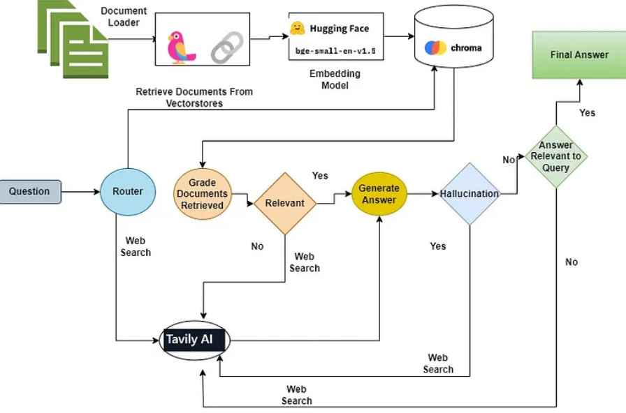

## The RAG Agent combine the below concepts 
* Adaptive RAG , build a Router for routing questions to different retrieval approaches

* Corrective RAG , develop a fallback mechanism to progress with when the context retrieved is irrelevant to the question asked.

* Self-RAG , develop a hallucination grader .i.e. fix answers that hallucinate or doesn’t address the question asked.

## Diagram
